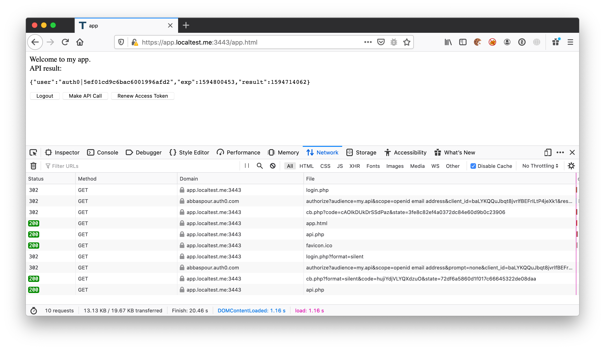

# Silent Front Channel Access Token Renewal for Web Applications 
Sample of SPA web application that stores Auth0 `access_token` as a server side cookie. 
Uses front channel silent ACG flow to renew `access_token` cookie. 

Start of the flow is normal ACG as with any RWA application. 
Silent authentication part is modified to do ACG inside an iframe. 

Why this approach:

* Works for same-origin SPA/BFF & RWA applications 
    * minimal server-side required to drop cookies
* Is immune to XSS attacks
    * AT never returned to JS
    * implicit grant is disabled 
* Depends on web-session 
    * SSO/SLO
* Compatible with step-up, MFA, max_age and other prompts
    * prompts client application that interactive login required 
    * Does silent authentication in the background
* no visible redirects
    * prompts client application that interactive login required
    * no lost JS state or hash-fragment due to full page redirect 
* Doesn’t require a smart heavy proxy layer 
    * direct API call from the browser
    * proxy is optional 
* Uses sameSite secure httpOnly cookies 

## Setup
### Environment Variables
Copy `env-sample` to `.env` and populate with your tenant & client settings. you require **a RWA client** with **only ACG grant enabled**. 

### HTTPS
```bash
openssl genrsa -out key.pem 2048
openssl req -new -x509 -key key.pem -out cert.pem -days 1095 -subj "/C=AU/ST=NSW/L=Sydney/O=Auth0/OU=Professional Services/CN=app.localtest.me"
cat key.pem cert.pem >> stunnel.pem
```

## Running

### Install Dependencies
```bash
composer install
```

### Local PHP server
local web server
```bash
php -S 127.0.0.1:3000
```
Visit [http://app.localtest.me:3000](http://app.localtest.me:3000)

### Run an HTTPS proxy
What proxy servers do 
1. terminate HTTPS
2. copy access_token from cookie to Authorization header 
3. (Optional) decrypt access-token
4. (Optional) validate access-token

Visit [https://app.localtest.me:3443](https://app.localtest.me:3443)

#### Stunnel
```bash
stunnel stunnel.conf
```

#### Nginx
Following the steps [in this gist](https://gist.github.com/abbaspour/af8dff3b297b0fcc6ba7c625c2d7c0a3) to enable [`ngx-http-auth-jwt-module`](https://github.com/TeslaGov/ngx-http-auth-jwt-module) in open source Nginx.
For RS256 access_tokens, use [`jwks.sh`](https://github.com/abbaspour/auth0-bash/blob/master/discovery/jwks.sh) to convert your tenant's jwks.json to x509 PEM file.  
Nginx proxy is configured to validate access_token & copy it to from cookie to Authorization header.
 
```bash
nginx -p . -c nginx.conf
```

#### Envoy
TBA


### (Optional) Renew self-sign Certificate 

#### 
## Screenshot


## Sequence Diagram


